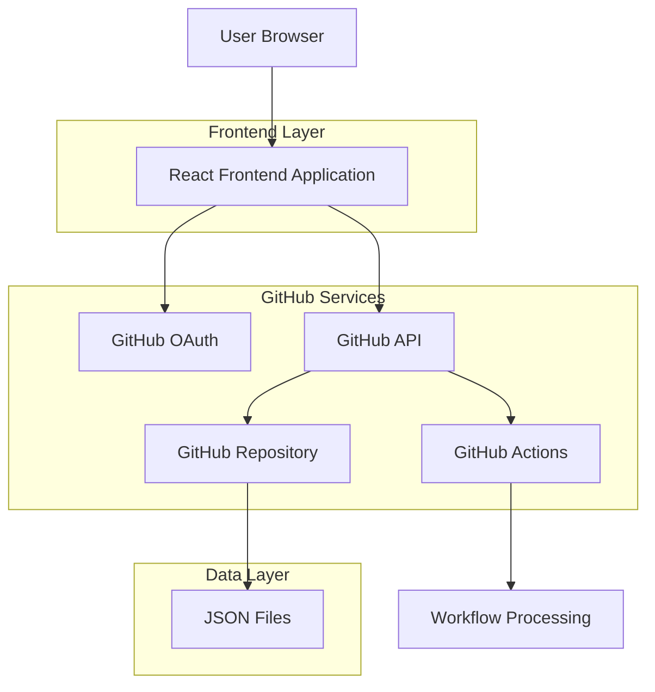
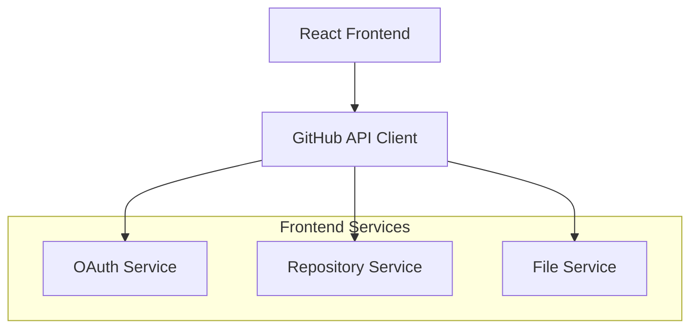
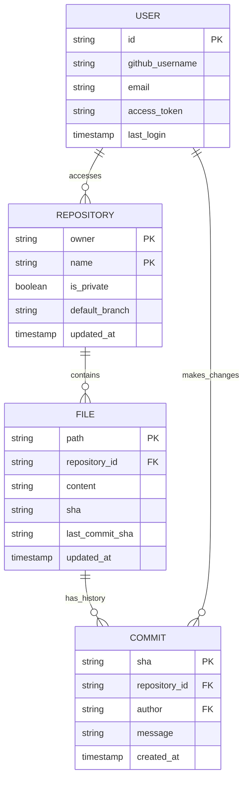

## 1. Architecture design



## 2. Technology Description

* Frontend: React\@18 + tailwindcss\@3 + vite

* Initialization Tool: vite-init

* Backend: None (GitHub API directly)

* Authentication: GitHub OAuth

* Storage: GitHub Repository (JSON files)

* CI/CD: GitHub Actions

## 3. Route definitions

| Route                         | Purpose                                  |
| ----------------------------- | ---------------------------------------- |
| /                             | Landing page with GitHub login           |
| /dashboard                    | Repository dashboard with file browser   |
| /editor/:owner/:repo/:path\*  | JSON file editor with optimistic locking |
| /history/:owner/:repo/:path\* | File history and diff viewer             |
| /settings                     | User preferences and repository settings |
| /callback                     | GitHub OAuth callback handler            |

## 4. API definitions

### 4.1 GitHub API Integration

Repository listing

```
GET https://api.github.com/user/repos
```

Request Headers:

| Header Name   | Value                          | Description        |
| ------------- | ------------------------------ | ------------------ |
| Authorization | token ${access\_token}         | GitHub OAuth token |
| Accept        | application/vnd.github.v3+json | API version        |

Response:

| Param Name  | Param Type | Description           |
| ----------- | ---------- | --------------------- |
| name        | string     | Repository name       |
| full\_name  | string     | Owner/repo format     |
| private     | boolean    | Repository visibility |
| updated\_at | string     | Last update timestamp |

File content retrieval

```
GET https://api.github.com/repos/:owner/:repo/contents/:path
```

Request:

| Param Name | Param Type | isRequired | Description      |
| ---------- | ---------- | ---------- | ---------------- |
| owner      | string     | true       | Repository owner |
| repo       | string     | true       | Repository name  |
| path       | string     | true       | File path        |

File update with optimistic locking

```
PUT https://api.github.com/repos/:owner/:repo/contents/:path
```

Request:

| Param Name | Param Type | isRequired | Description                             |
| ---------- | ---------- | ---------- | --------------------------------------- |
| message    | string     | true       | Commit message                          |
| content    | string     | true       | Base64 encoded file content             |
| sha        | string     | true       | Current file SHA for optimistic locking |
| branch     | string     | false      | Target branch (default: main)           |

## 5. Server architecture diagram

Since this application uses GitHub as the backend service, the architecture is client-side focused:



## 6. Data model

### 6.1 Data model definition



### 6.2 Data Definition Language

Since data is stored in GitHub repositories, the application uses local storage for caching:

User session cache (localStorage)

```javascript
// User session structure
{
  "user": {
    "id": "github_user_id",
    "username": "github_username",
    "email": "user@example.com",
    "access_token": "github_oauth_token",
    "avatar_url": "https://github.com/user.png"
  },
  "repositories": [
    {
      "owner": "owner_name",
      "name": "repo_name",
      "full_name": "owner_name/repo_name",
      "private": false,
      "updated_at": "2024-01-01T00:00:00Z"
    }
  ]
}
```

File metadata cache (IndexedDB)

```javascript
// File metadata structure
{
  "path": "config/app.json",
  "repository": "owner/repo",
  "sha": "abc123def456",
  "last_modified": "2024-01-01T00:00:00Z",
  "content_size": 1024,
  "lock_status": "unlocked",
  "lock_holder": null,
  "lock_expires": null
}
```

### 6.3 GitHub Actions Configuration

Workflow file (.github/workflows/process-point.yml)

```yaml
name: Process Point Integration
on:
  push:
    paths:
      - '**/*.json'
  pull_request:
    paths:
      - '**/*.json'

jobs:
  validate-json:
    runs-on: ubuntu-latest
    steps:
      - uses: actions/checkout@v4
      - name: Validate JSON files
        run: |
          for file in $(find . -name "*.json"); do
            python -m json.tool "$file" > /dev/null || exit 1
          done
      - name: Process Point Notification
        if: success()
        run: echo "JSON validation completed successfully"
```

## 7. Optimistic Locking Implementation

The optimistic locking mechanism uses GitHub's SHA-based content addressing:

1. **Lock Acquisition**: Before editing, fetch current file SHA
2. **Edit Phase**: User makes changes locally
3. **Save Attempt**: Send update with original SHA
4. **Conflict Detection**: GitHub rejects if SHA doesn't match
5. **Resolution**: Show diff and allow merge conflict resolution

```javascript
// Optimistic locking flow
const editFile = async (filePath, content) => {
  // 1. Get current file info
  const currentFile = await getFile(filePath);
  const originalSha = currentFile.sha;
  
  // 2. User edits content...
  
  // 3. Attempt save with optimistic lock
  try {
    await updateFile(filePath, content, originalSha);
  } catch (error) {
    if (error.status === 409) {
      // 4. Handle conflict
      const conflictResolution = await resolveConflict(filePath, content);
      await updateFile(filePath, conflictResolution.content, conflictResolution.sha);
    }
  }
};
```

