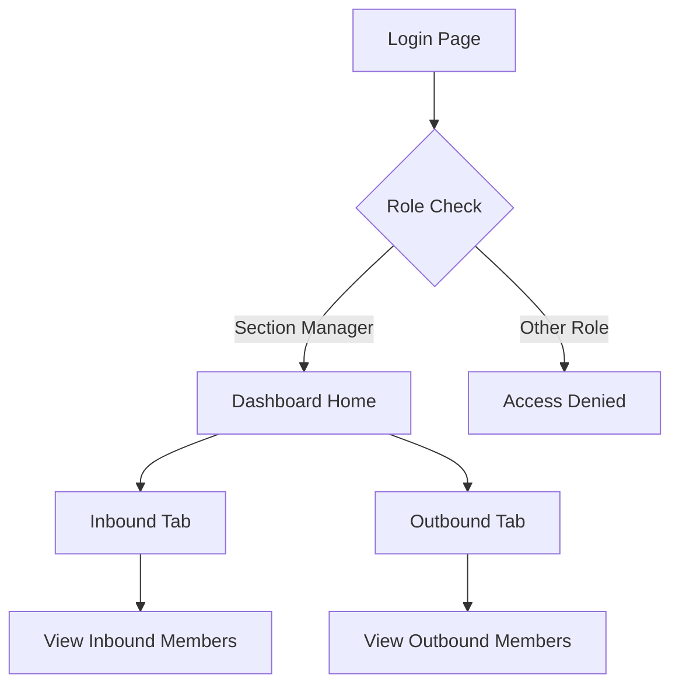

## 1. Product Overview
Section Manager Dashboard provides managers with visibility into their section's personnel movements. This dashboard enables section managers to monitor and track both inbound and outbound members within their assigned section, facilitating better workforce management and transition oversight.

## 2. Core Features

### 2.1 User Roles
| Role | Registration Method | Core Permissions |
|------|---------------------|------------------|
| Section Manager | Admin assignment | View inbound/outbound members for their section only |
| Admin | System setup | Assign section managers, manage all sections |

### 2.2 Feature Module
The section manager dashboard consists of the following main components:
1. **Dashboard Home**: Section overview with inbound/outbound tabs
2. **Inbound Tab**: List of members joining the section
3. **Outbound Tab**: List of members leaving the section

### 2.3 Page Details
| Page Name | Module Name | Feature description |
|-----------|-------------|---------------------|
| Dashboard Home | Section Header | Display current section name and manager information |
| Dashboard Home | Navigation Tabs | Switch between Inbound and Outbound views |
| Inbound Tab | Member List | Show all members scheduled to join the section |
| Inbound Tab | Member Details | Display name, position, start date, and status |
| Outbound Tab | Member List | Show all members scheduled to leave the section |
| Outbound Tab | Member Details | Display name, position, end date, and destination |

## 3. Core Process
Section Manager Flow:
1. Manager logs into the system with their credentials
2. System verifies their Section Manager role and assigned section
3. Dashboard loads showing their specific section data
4. Manager can toggle between Inbound and Outbound tabs
5. Each tab displays relevant member information in a list format

## 4. User Interface Design

### 4.1 Design Style
- Primary color: Professional blue (#2563eb)
- Secondary color: Light gray (#f3f4f6)
- Button style: Rounded corners with subtle shadows
- Font: System fonts with 14-16px base size
- Layout: Card-based with clear section separation
- Icons: Minimal line icons for better readability

### 4.2 Page Design Overview
| Page Name | Module Name | UI Elements |
|-----------|-------------|-------------|
| Dashboard Home | Section Header | Bold section name, manager badge, last updated timestamp |
| Dashboard Home | Navigation Tabs | Two prominent tabs with active state highlighting |
| Inbound Tab | Member Cards | Grid layout with member photos, names, positions, start dates |
| Outbound Tab | Member Cards | Similar to inbound with end dates and destination sections |

### 4.3 Responsiveness
Desktop-first design approach with mobile adaptation. The dashboard will maintain usability on tablets and phones with responsive grid layouts and touch-friendly interactions.