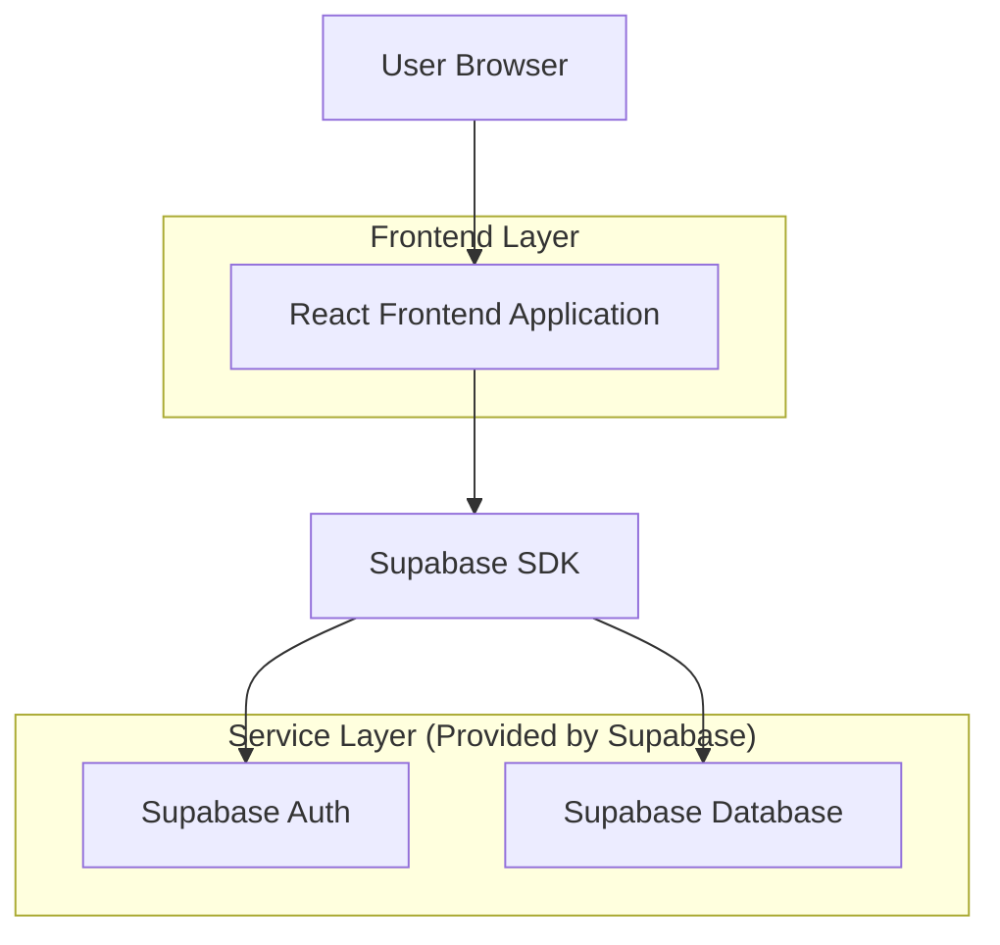
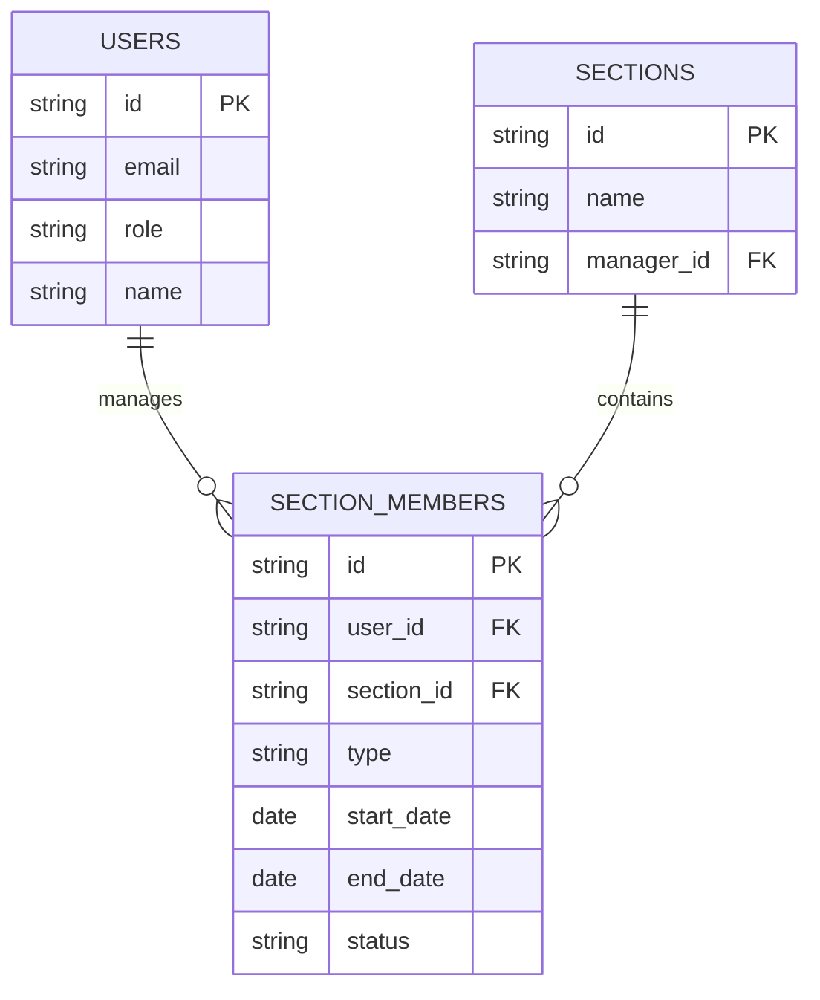

## 1. Architecture design



## 2. Technology Description
- Frontend: React@18 + tailwindcss@3 + vite
- Initialization Tool: vite-init
- Backend: Supabase (Authentication + Database)
- Database: PostgreSQL (via Supabase)

## 3. Route definitions
| Route | Purpose |
|-------|---------|
| /dashboard | Section Manager Dashboard main page |
| /login | Authentication page for section managers |
| /unauthorized | Access denied page for non-section managers |

## 4. API definitions

### 4.1 Core API

Section-based member data retrieval
```
GET /api/sections/{sectionId}/members
```

Request:
| Param Name| Param Type  | isRequired  | Description |
|-----------|-------------|-------------|-------------|
| sectionId | string      | true        | The unique identifier of the manager's section |
| type      | string      | false       | Filter by 'inbound' or 'outbound' |

Response:
| Param Name| Param Type  | Description |
|-----------|-------------|-------------|
| members   | array       | Array of member objects |
| count     | number      | Total number of members |

Example
```json
{
  "members": [
    {
      "id": "uuid-123",
      "name": "John Doe",
      "position": "Software Engineer",
      "startDate": "2024-01-15",
      "endDate": null,
      "type": "inbound",
      "status": "scheduled"
    }
  ],
  "count": 1
}
```

## 5. Server architecture diagram
Not applicable - using Supabase backend-as-a-service

## 6. Data model

### 6.1 Data model definition


### 6.2 Data Definition Language

Users Table (users)
```sql
-- create table
CREATE TABLE users (
    id UUID PRIMARY KEY DEFAULT gen_random_uuid(),
    email VARCHAR(255) UNIQUE NOT NULL,
    name VARCHAR(100) NOT NULL,
    role VARCHAR(50) DEFAULT 'employee' CHECK (role IN ('employee', 'section_manager', 'admin')),
    created_at TIMESTAMP WITH TIME ZONE DEFAULT NOW(),
    updated_at TIMESTAMP WITH TIME ZONE DEFAULT NOW()
);

-- create index
CREATE INDEX idx_users_role ON users(role);
CREATE INDEX idx_users_email ON users(email);
```

Sections Table (sections)
```sql
-- create table
CREATE TABLE sections (
    id UUID PRIMARY KEY DEFAULT gen_random_uuid(),
    name VARCHAR(100) NOT NULL,
    manager_id UUID REFERENCES users(id),
    created_at TIMESTAMP WITH TIME ZONE DEFAULT NOW(),
    updated_at TIMESTAMP WITH TIME ZONE DEFAULT NOW()
);

-- create index
CREATE INDEX idx_sections_manager ON sections(manager_id);
```

Section Members Table (section_members)
```sql
-- create table
CREATE TABLE section_members (
    id UUID PRIMARY KEY DEFAULT gen_random_uuid(),
    user_id UUID REFERENCES users(id) NOT NULL,
    section_id UUID REFERENCES sections(id) NOT NULL,
    type VARCHAR(20) CHECK (type IN ('inbound', 'outbound')) NOT NULL,
    start_date DATE,
    end_date DATE,
    status VARCHAR(20) DEFAULT 'scheduled' CHECK (status IN ('scheduled', 'active', 'completed')),
    created_at TIMESTAMP WITH TIME ZONE DEFAULT NOW(),
    updated_at TIMESTAMP WITH TIME ZONE DEFAULT NOW()
);

-- create index
CREATE INDEX idx_section_members_user ON section_members(user_id);
CREATE INDEX idx_section_members_section ON section_members(section_id);
CREATE INDEX idx_section_members_type ON section_members(type);
```

-- Grant permissions
GRANT SELECT ON sections TO anon;
GRANT SELECT ON section_members TO anon;
GRANT ALL PRIVILEGES ON sections TO authenticated;
GRANT ALL PRIVILEGES ON section_members TO authenticated;